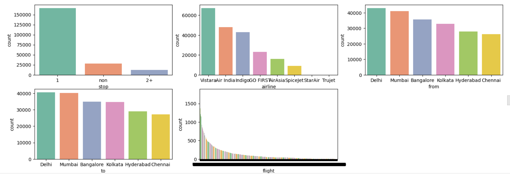

# DataAnalystPortfolioProjects
## Following are my projects in Tableau, Python, SQL & Excel:
### You can also take a look at my Linkedin : [Shivam Kumar](www.linkedin.com/in/shivamkumar5)

- [x] **Tableau**  
1. British Airways Review.  
*See on Tableau Public:* **[Dashboard](https://public.tableau.com/app/profile/shivam.kumar8742/viz/BritishAirwaysReview_17093175465620/Dashboard1?publish=yes)**

2. Sales report of ATLIQ company.  
*See on Tableau Public:* **[Dashboard](https://public.tableau.com/app/profile/shivam.kumar8742/viz/SalesdataofATLIQcompany/Dashboard1?publish=yes)**

  

- [x] **SQL** - 
1. Music Store Dataset: Data Analysis  
*Review the SQL Script:* **[HERE](https://github.com/kumarshivam99/SQL_project/blob/main/Music%20_store_queries.sql)** 

2. Faasos Dataset: Data Analysis  
*Review the SQL Script:* **[HERE](https://github.com/kumarshivam99/SQL_project/blob/main/fassos_dataset_queries.sql)** 

- [x] **Python** - 
  - Student Performance in exam Dataset: Exploratory Data Analysis Project  
*Read the complete Project Analysis:* **[HERE](https://github.com/kumarshivam99/EDA_using_python/blob/main/EDA_Students_Performance_Indicator.ipynb)** 

*A snippet of the project given below:*

- Flight Price Prediction Dataset: Exploratory Data Analysis Project  
*Read the complete Project Analysis:* **[HERE](https://github.com/kumarshivam99/EDA_using_python/blob/main/Flight_Price_Prediction.ipynb)** 

*A snippet of the project given below:*

- [x] **Power BI** -  
1. Local Mart Sales Dashboard.  
*Download the file:* **[Here](https://github.com/kumarshivam99/PowerBI-Projects/blob/main/Local_Mart_Sales_Dashboard.pbix)**

- [x] **Excel** - 

*Download the Excel files from repository and open them using Microsoft Excel for viewing and analysis.*

- Bike Sales Report: Sales Analysis Dashboard [HERE](https://github.com/kumarshivam99/Excel-Project)  

  

- Road Accident Dashboard [HERE](https://docs.google.com/spreadsheets/d/1eDS-_PGXWA4t7YVNqRGyY7hwompxW-_2/edit?usp=sharing&ouid=114920734155400360383&rtpof=true&sd=true)  

